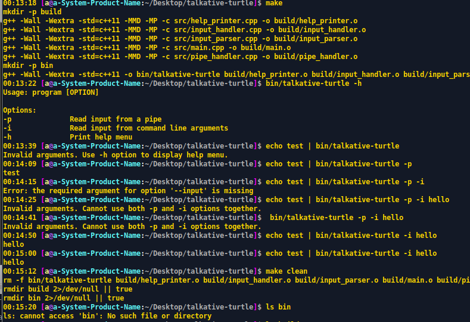

# Talkative Turtle

> Generated "mostly*¹" with chatgpt :) 

> (*¹ some mistakes fixed manually but probably could've had chatgpt do this too with the correct questions ...

> Had to start over a few times, redefine questions, start new conversations, paste existing previously generated code and ask for suggestions to archive target x.

> After completition of the setup asked chatgpt to move functions to separate files - so ended up with a single-file setup and the multi-file setup in src.

Talkative Turtle is a command-line utility that allows users to input data from different sources and output it to the console. 
The program is written in C++ and uses the Boost C++ library to parse command-line arguments.

## Usage
> The program includes three options:

To use Talkative Turtle, simply run the `talkative-turtle` executable with one of the following options:

- `-p`: Reads input from a pipe
    - Example: `echo "hello world" | ./talkative-turtle -p`
- `-i`: Reads input from command-line arguments
    - Example: `./talkative-turtle -i "hello world"`
- `-h`: Prints a help menu
    - Example: `./talkative-turtle -h`

If the `-h` or `--help option is provided`, the print_help function is executed, which prints a help menu that explains the available options.

If the `-p` or `--pipe option is provided`, the handle_pipe_input function is executed, which reads input from the standard input stream and parses the input using the parse_input function. 
The parsed arguments are then printed to the console.

If the `-i` or `--input option is provided`, the handle_entered_input function is executed, which takes the input string provided as an argument and parses it using the parse_input function. 
The parsed arguments are then printed to the console.

If none of the valid options are provided or if both -p and -i options are provided, an error message is printed to the console. 
If an exception occurs during execution, an error message is printed with the exception details.

- 
## Getting Started

To get started with Talkative Turtle, simply clone the repository to your local machine and compile the program using your preferred C++ compiler. 
The program has been tested with GCC and Clang, but should work with other compilers as well. (chatgpt lied here lol, i tested it with gcc)

`git clone https://github.com/[username]/talkative-turtle.git`
1. option

`cd talkative-turtle/single_source-file_setup/`

`g++ -o talkative-turtle main.cpp -lboost_program_options`

`./talkative-turtle [options]`

2. option

`cd talkative-turtle/`

`make`

`./talkative-turtle [options]`

## Summary

This basic C++ code provides the functionality for parsing command-line arguments and executing different functions based on the provided arguments.

It also includes an implementation for parsing a string that contains command-line arguments separated by spaces or quotes. This code could be useful as a starting point for building command-line tools or utilities that require user input.

The program uses the Boost C++ library for program options, which allows defining valid options, parsing the command-line arguments, and checking for valid arguments. 
The code defines three program options: help `-h`, pipe `-p`, and input `-i`.

When the program is executed, it first parses the command-line arguments using the boost::program_options::parse_command_line function. Then, based on the provided options, it executes the corresponding functions.

Overall, this code provides a good foundation for building a command-line tool or utility that requires user input and handles various command-line arguments.

The provided C++ code demonstrates the use of the Boost C++ library to parse command-line arguments and execute different functions based on the provided options. 
The code defines three program options: help, pipe, and input, and uses the boost::program_options library to parse the command-line arguments and check for valid options.

The program includes three functions: 
> 1 & 2 functions print the parsed arguments to the console. Each corresponding to one of the program options. 
1. handle_pipe_input
> The handle_pipe_input function reads input from the standard input stream and parses it using the parse_input function, which separates the input into individual arguments. 
2. handle_entered_input
> The handle_entered_input function takes the input string provided as an argument and uses the parse_input function to separate the arguments. 
3. print_help
> The print_help function prints a help menu that explains the available program options. 
If the -h or --help option is provided, this function is executed.

If none of the valid options are provided or if both `-p` (handle_pipe_input) and `-i` (handle_entered_input) options are provided, an error message is printed to the console. 

If an exception occurs during execution, an error message is printed with the exception details.

